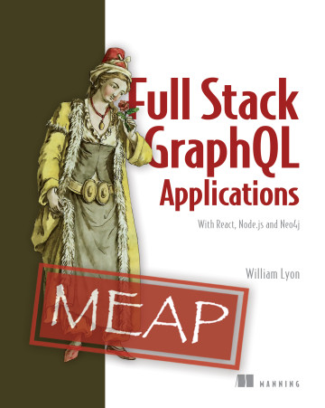

# Full Stack GraphQL Applications

This is the companion repository to the book [*Full Stack GraphQL Applications With React, Node.js, and Neo4j*](https://www.manning.com/books/fullstack-graphql-applications) written by [William Lyon](https://twitter.com/lyonwj) and published by Manning. Here you can find the [code](code/) to accompany each chapter as well as the [exercises and solutions](fullstack-graphql-book/tree/main/exercises) from each chapter. You can also find recordings of an [online book club series covering each chapter of the book on YouTube here](https://www.youtube.com/playlist?list=PL9Hl4pk2FsvVg3c74thYEWVsCPPVB1qqn).

## Table of Contents

* **1: What Is Full Stack GraphQL?** ([Exercises](exercises/chapter1), [Book Club Video](https://www.youtube.com/watch?v=P6hXgvcuspg&list=PL9Hl4pk2FsvVg3c74thYEWVsCPPVB1qqn&index=2))
* **2: Graph Thinking With GraphQL** ([Code](code/chapter2), [Exercises](exercises/chapter2), [Book Club Video](https://www.youtube.com/watch?v=8uXLEG3qOIs&list=PL9Hl4pk2FsvVg3c74thYEWVsCPPVB1qqn&index=2))
* **3: Graphs In The Database** ([Code](code/chapter3), [Exercises](exercises/chapter3), [Book Club Video](https://www.youtube.com/watch?v=yI3PYW-MVvQ&list=PL9Hl4pk2FsvVg3c74thYEWVsCPPVB1qqn&index=3))
* **4: The Neo4j GraphQL Library** ([Code](code/chapter4), [Exercises](exercises/chapter4), [Book Club Video](https://www.youtube.com/watch?v=jilGjRLuKYE&list=PL9Hl4pk2FsvVg3c74thYEWVsCPPVB1qqn&index=4))
* **5: Building User Interfaces With React** ([Code](code/chapter5), [Exercises](exercises/chapter5), [Book Club Video](https://www.youtube.com/watch?v=Wwm8KBkGCrc&list=PL9Hl4pk2FsvVg3c74thYEWVsCPPVB1qqn&index=5))
* **6: Client Side GraphQL With React & Apollo Client** ([Code](code/chapter6), [Exercises](exercises/chapter6), [Book Club Video](https://www.youtube.com/watch?v=uPYDtfNjzWA&list=PL9Hl4pk2FsvVg3c74thYEWVsCPPVB1qqn&index=6))
* **7: Adding Authorization & Authentication** ([Code](code/chapter7), [Exercises](exercises/chapter7), [Book Club Video](https://www.youtube.com/watch?v=WrWbGml-7x8&list=PL9Hl4pk2FsvVg3c74thYEWVsCPPVB1qqn&index=7))
* **8: Deploying Our Full Stack GraphQL Application** ([Code](code/chapter8), Exercises)
* **9: Advanced GraphQL Considerations** ([Code](code/chapter9), Exercises)

## ReactJS Components

The ReactJS source code in `src/components` has a dependency on an older version of Material UI for React. Instead of attempting to build the components (with `npm run build`) from within this project directory, copy them into the `src/components` subdirectory of your React frontend and then ensure the dependencies are available in that project by running:

    npm install --legacy-peer-deps --no-save "@material-ui/core"@"^4.12.4" "@types/react"@"^18.0.15" "@types/react-dom"@"^18.0.6" "react"@"^18.2.0" "react-dom"@"^18.2.0"

## Business Review App

### User Stories

> The requirements for our application are
>   1) As a user, I want to search for a list of businesses by category, location, and name.
>   2) As a user, I want to view details for each business (name, description, address, photos, etc.).
>   3) As a user, I want to view reviews for each business, including a summary for each business, and rank my search by favorably reviewed businesses.
>   4) As a user, I want to create a review for a business.
>   5) As a user, I want to connect my friends and users who have tastes that I like, so I can follow my friends’ reviews.
>   6) As a user, I want to receive personalized recommendations based on reviews I have previously written and my social network.
>   

### Relationship Requirements

> Let’s add the following relationships:
>   1) Users write reviews.
>   2) Reviews are connected to a business.
>   3) Users upload photos.
>   4) Photos are tagged to businesses.
> 

